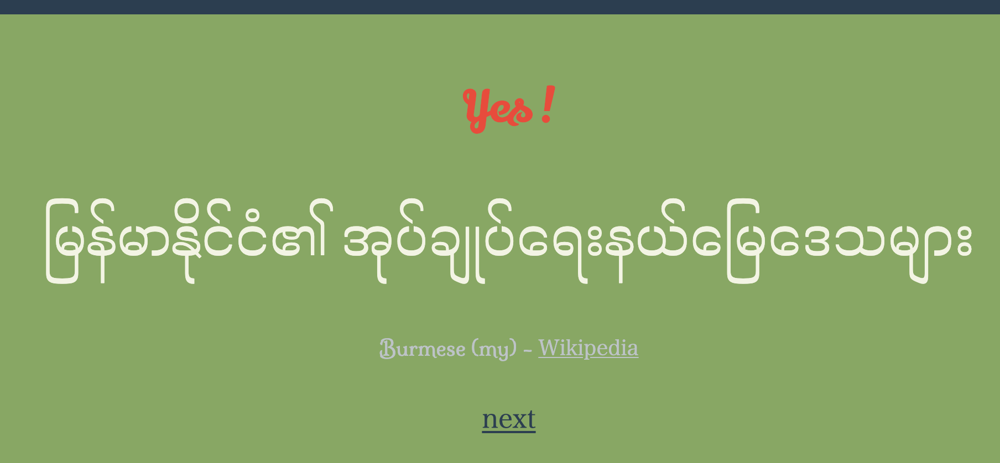

# my/ka

Burmese or Georgian ?





- Retrieved page titles from Brumese and Georgian Wikipedia - [scrape.ipynb](myka/data/wikipedia/scrape.ipynb)
- Flask for the Web
- Noto Serif fonts for the characters

Characters of both langauges looks beautiful.

## How to run

```
$ pip install flask

$ git clone https://github.com/sorami/myka.git
$ cd myka
$ export FLASK_APP=myka
$ flask run
```

... and access http://127.0.0.1:5000/ with your browser!
